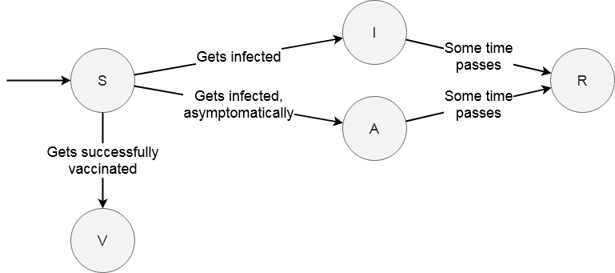
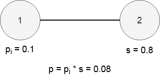
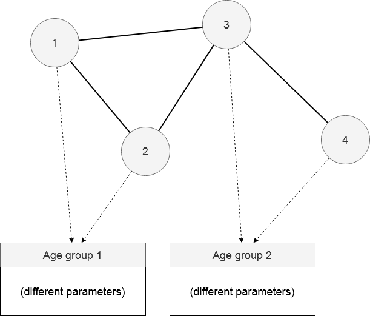

## COVID-19 Simulation Model
 -- by Christopher Rydell

This document describes the discrete, agent-based SAIVR model we will implement for our COVID-19 simulation. The first section describes the fundamental model required for the simulation to do something useful, while the second section describes different extensions that could be made to the model. This document does not describe the generation of the graphs used for the simulation.

## Fundamental Model
The model we will implement is an extension of the SIR model described by Kaxiras and Neofotistos. Our model adds two additional compartments: asymptomatic and vaccinated, and moves from a matrix approach to a graph-based approach. This section describes how this model needs to work to achieve its minimal goals.

### Model Goals
Our model should be able to describe how the disease spreads through a population, and should also be able to be used for investigating different vaccination deployment strategies. The basic strategies that could be tried would involve deploying to highly infected areas first, deploying to areas with few infections first, or deploying randomly. We would also like to model asymptomatic behaviour, and according to Kronbichler et al., “Among other factors, age has been described as a risk factor for a more severe disease course, while younger people seem to have mild or even asymptomatic presentations and thus might be crucial in further spreading of the disease”.

### Model Overview
Based on the goals for the fundamental model, we need to represent the five different compartments of SAIVR, regions of populations, and age groups. The agents will be connected in an undirected graph, where the edges represent any type of contact between two agents that could transmit the disease. Agents in the same region will have more connections between each other than to agents in other regions, but some cross-region connections will be needed.

#### Compartments
An agent is at any time within one of the compartments **S**usceptible, **A**symptomatic, **I**nfected, **V**accinated or **R**ecovered, and behaves differently depending on which one they belong to.

*  Susceptible agents represent people who have not been infected yet, and are able to become asymptomatic, infected or vaccinated.
*  Asymptomatic agents can infect susceptible agents much like infected agents can, become removed after some time, but are counted separately, have a different infection risk, and are otherwise treated as susceptible.
*  Infected agents can transmit the infection to susceptible agents and become removed after some time.
*  Vaccinated agents can neither spread the disease nor be infected.
*  Recovered agents can neither spread the disease nor be infected.

#### Interaction between two nodes

The simulation is divided into time steps. In each time step, each infected or asymptomatic node will attempt to infect either (1) all its neighbours, or (2) a random subset of its neighbours. Each infection attempt is done by calculating the probability of infection between the two nodes, sampling from a uniform distribution between 0 and 1, and seeing if this sampled value is lower than the probability. If it is, the susceptible node is infected. The node attempting to infect has a parameter for infectiousness. A parameter can also be used for the susceptibility of the target, which can be multiplied with the infectiousness to get the infection probability. The susceptibility parameter can be set to 1 if all agents should be fully susceptible.

The image below shows an example of how the probability of infection p is calculated when node 1, with infectiousness pi tries to infect its neighbour node 2, with susceptibility s.

Upon being infected, the susceptible node has some probability of instead becoming asymptomatically infected. This is sampled the same way as the infection itself, except with a different probability.

#### Selecting infection targets
As mentioned, we will have two methods for selecting neighbours to infect. The first method, from our original model, simply tries to infect all neighbouring nodes. The second method, from the other group’s model, selects only a subset of neighbours. Originally, each agent only selected a single random neighbour each time-step. We could add a parameter for this, such that the agent will select n random neighbours to try to infect instead.

#### Age groups
Each agent belongs to an age group, which lets us model things like e.g. having different rates of asymptomatic infections. Each age group can have different parameters, but some parameters can be left the same if we want them to be shared. The specific ages do not have to be strictly defined, and the number of age groups and their parameters can be defined at runtime. This representation is general enough that we could use it for groups other than age, e.g. people with weak immune systems. The image below shows how each agent has a reference to one age group from which they will get their parameters.

One set of age groups we could use could be the ones used by Guan et. al., i.e. 0-14, 15-49, 50-64 and >=65.

#### Regions
Each agent will belong to a specific region, which can represent things like countries, municipalities, or towns. This can be used to model different vaccination strategies by looking at the current compartment counts for each city. The structuring and generation of the regions has more to do with the graph generation than this model description, but we can assume that agents in the same region will have more connections between each other than to other regions. At each time step, the number of agents in each compartment should be counted for each region. This will be useful both for vaccine deployment and visualization of the simulation.

In practice, the regions could simply be represented by an array of offset values. If agents in the same region are always adjacent in the matrix format we use, we can check this array to see which region’s results we should update.

#### Vaccination
At a certain time step in the simulation, vaccinations will begin to deploy to susceptible and asymptomatic agents. After a certain amount of time, susceptible agents that have been vaccinated will enter the Vaccinated compartment with a given probability. If they do not succeed in being vaccinated, they stay susceptible.

Only a certain amount of vaccines will be available each day, to represent the fact that production takes time. Vaccine deployment can follow different strategies. To begin with, we could use three different strategies. The first one would start by vaccinating regions with high rates of infected and recovered agents. The second one would start by vaccinating regions with low rates. The last one would be to vaccinate arbitrarily throughout the population.

When implementing this, it would make sense to have it be quite modular from the rest of the code, since it seems like something that we might want to extend with more methods.

#### Parameters
General parameters:

Selection type - A value that simply tells us whether we should use method (1) or method (2) when selecting neighbours to try to infect.

Vaccine deployment type - Which strategy should be used for deploying the vaccine.

T (simulation duration) - The total number of time steps in the simulation

initial_infections (initial infected count) - The number of infected agents at the start of the simulation

Tv (vaccination start time) - The time at which the vaccine starts being deployed.

nv (vaccine count) - The number of vaccines available each time step.

Parameters for each age group, some could be set to be the same for different age groups. Some parameters, like di and dai could reasonably be set to be the same, but would be simple to implement separately in case it ever becomes desirable to have them be different:

ni (infection attempts) - The number of random neighbours an infected agent should try to infect each time step, when method (2) is used.

nai (asymptotic infection attempts) - The number of random neighbours an asymptotic agent should try to infect each step, when method (2) is used.

s (susceptibility) - A value between 0 and 1, multiplied with an infection probability to lessen the probability of being infected.

pi (infectiousness) - A value between 0 and 1, used as a parameter to a Bernoulli distribution that determines whether the agent infects a susceptible agent or not. This is multiplied by the target’s susceptibility.

pai (asymptomatic infectiousness) - Used the same way as infectiousness, but is instead used when the infecting agent is asymptomatic.

pt (travel probability) - The probability for an agent to travel in a given time step.

pat (asymptomatic travel probability) - The probability of travelling if the agent is asymptomatic.

pv (vaccine effectiveness) - A value between 0 and 1, used for a Bernoulli distribution to sample whether or not a vaccination succeeds.

dv (vaccine duration) - The time taken for vaccination to become effective after being vaccinated.

di (infection duration) - The time taken for an agent to go from infected to recovered.

dai (asymptotic infection duration) - The time taken for an agent to go from asymptomatic to recovered.

ap (asymptomatic chance) - The probability of becoming asymptomatic when being infected.

## Potential extensions
This section describes some extensions that could be made to the model after the fundamental model is completed. They would have to be fleshed out a bit more before implementation.

### Additional vaccination methods
We might want to make it possible to investigate additional vaccination methods. Some methods that we could try would be to base the vaccination deployment on age groups instead of regions. Another would be to vaccinate in an annulus around a region with a lot of infections, which seems to be something Tildesley et al. investigated for livestock vaccination.

### Isolation
We could simulate the isolation of infected nodes in different ways. Asymptotic agents should not be isolated, since they do not know that they can infect people. The simplest way for selection method (2) could be implemented with the fundamental model by simply having ni be lower than nai. Another method would be to limit the number of people who can be infected by an agent to a smaller set of its neighbours. This subset of neighbours would be the same for each time-step, which would mimic D shrinking in the matrix model.

### Lockdowns
We could do something similar to what the matrix model did with a shrinking value for D after a certain point in time. This implementation can be done similarly to isolation, except with a parameter that changes based on the current time step.

### Different types of edges
We could try to integrate something similar to the edges module written earlier in the project in order to represent different types of contact between two agents. This would however probably add a lot of complexity to the graph generation.

(Some unorganized sources I’ve been looking at, some more relevant than others. Leaving them here for quick access)

[https://www.nejm.org/doi/full/10.1056/NEJMoa2002032](https://www.nejm.org/doi/full/10.1056/NEJMoa2002032)

[https://www.medrxiv.org/content/medrxiv/early/2020/09/24/2020.09.22.20194183.1.full.pdf](https://www.medrxiv.org/content/medrxiv/early/2020/09/24/2020.09.22.20194183.1.full.pdf)

[https://www.ncbi.nlm.nih.gov/pmc/articles/PMC7270890/](https://www.ncbi.nlm.nih.gov/pmc/articles/PMC7270890/)

[https://link.springer.com/article/10.1007/s11071-020-05704-5](https://link.springer.com/article/10.1007/s11071-020-05704-5)

[https://arxiv.org/pdf/cond-mat/0106096.pdf](https://arxiv.org/pdf/cond-mat/0106096.pdf)

[https://www.researchgate.net/profile/Qaisar_Badshah/publication/280446242_Global_stability_of_SEIVR_epidemic_model_with_generalized_incidence_and_preventive_vaccination/links/562f47b208ae04c2aeb6e74b.pdf](https://www.researchgate.net/profile/Qaisar_Badshah/publication/280446242_Global_stability_of_SEIVR_epidemic_model_with_generalized_incidence_and_preventive_vaccination/links/562f47b208ae04c2aeb6e74b.pdf)

[https://pdfs.semanticscholar.org/cdc7/91e96a0859ae3b78a55064e6526013ad5edf.pdf](https://pdfs.semanticscholar.org/cdc7/91e96a0859ae3b78a55064e6526013ad5edf.pdf)

[https://www.medrxiv.org/content/medrxiv/early/2020/09/24/2020.09.22.20194183.1.full.pdf](https://www.medrxiv.org/content/medrxiv/early/2020/09/24/2020.09.22.20194183.1.full.pdf)

[https://journals.plos.org/plosntds/article?id=10.1371/journal.pntd.0004802](https://journals.plos.org/plosntds/article?id=10.1371/journal.pntd.0004802)

[https://www.researchgate.net/profile/Bryan_Grenfell/publication/7267382_Optimal_reactive_vaccination_strategies_for_a_foot-and-mouth_outbreak_in_the_UK/links/0912f506991d468aff000000/Optimal-reactive-vaccination-strategies-for-a-foot-and-mouth-outbreak-in-the-UK.pdf](https://www.researchgate.net/profile/Bryan_Grenfell/publication/7267382_Optimal_reactive_vaccination_strategies_for_a_foot-and-mouth_outbreak_in_the_UK/links/0912f506991d468aff000000/Optimal-reactive-vaccination-strategies-for-a-foot-and-mouth-outbreak-in-the-UK.pdf)

[https://www.sciencedirect.com/science/article/pii/S1201971220304872#bib0025](https://www.sciencedirect.com/science/article/pii/S1201971220304872#bib0025)

[https://www.nejm.org/doi/full/10.1056/NEJMc2001468](https://www.nejm.org/doi/full/10.1056/NEJMc2001468)

[https://www.ncbi.nlm.nih.gov/pmc/articles/PMC7270890/](https://www.ncbi.nlm.nih.gov/pmc/articles/PMC7270890/)

[https://jamanetwork.com/journals/jama/fullarticle/2762028](https://jamanetwork.com/journals/jama/fullarticle/2762028)

[https://barabasi.com/f/67.pdf](https://barabasi.com/f/67.pdf)
